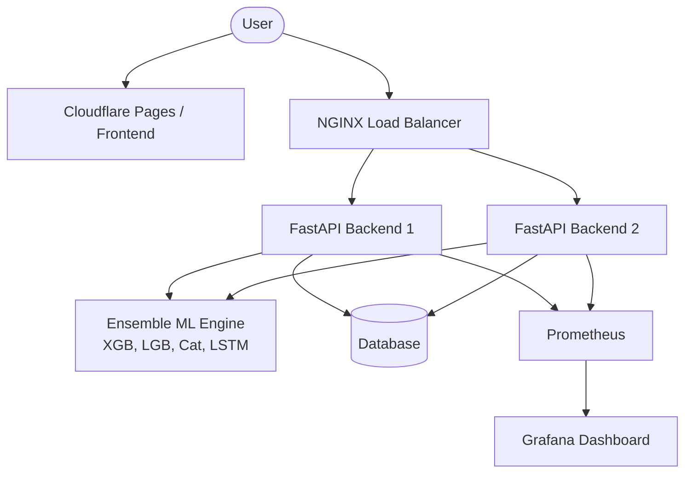

# AntiGravity Traffic Intelligence System

This document outlines the architecture and implementation plan for building a production-ready, scalable predictive traffic system.

## User Review Required

> [!WARNING]
> This is a massive full-stack build. Please review the architecture and confirm if you'd like to proceed with the entire generation step-by-step in this workspace, or if you already have existing code you wanted me to fix (currently the workspace is empty).
> 
> Additionally, since Google Maps APIs (Maps JavaScript API, Places API, Routes API, Traffic Layer) require a valid API key, you will need to provide one or we can set up the frontend to accept an environment variable for it.

## Proposed Architecture

## Proposed Changes

### Frontend (React + Google Maps)
We will scaffold a modern React application.
- `frontend/src/App.js` - Main layout and routing
- `frontend/src/components/Map.js` - Google Maps integration (Live Traffic, Satellite/Map toggle)
- `frontend/src/components/Sidebar.js` - Route planning, autocomplete, predictions
- `frontend/src/components/Auth.js` - Login/Signup enforcing strict passwords
- `frontend/src/api.js` - Connection to FastAPI backend
- `frontend/Dockerfile`

### Backend (FastAPI)
We will build a robust Python backend.
- `backend/main.py` - API routing (`/health`, `/metrics`, etc.)
- `backend/auth.py` - JWT authentication, bcrypt password hashing, strong password validation
- `backend/ml_engine.py` - Ensemble prediction logic (XGBoost, LightGBM, CatBoost, LSTM) averaging
- `backend/Dockerfile`

### Infrastructure & DevOps
We will containerize and orchestrate the stack.
- `docker-compose.yml` - Sets up the entire local stack
- `nginx/nginx.conf` - Load balancing configuration
- `prometheus/prometheus.yml` - Metrics collection
- `grafana/` - Monitoring dashboards

## Verification Plan

### Automated/Local Tests
- Run `docker-compose up --build` and ensure all containers (frontend, backend replicas, nginx, prometheus, grafana) start correctly.
- Verify JWT auth via `/signup` and `/login` endpoints.
- Test ML prediction endpoint `/predict` for valid ensemble response.

### Manual Verification
- Open the frontend, test user geolocation, and route autocomplete.
- Verify map renders with traffic and satellite toggles.
- Verify predictions display alongside current traffic.
